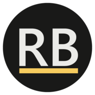

<a name="readme-top"></a>

<!-- PROJECT SHIELDS -->

[![TypeScript version][typescript]][typescript-url]
[![React version][react-version]][react-url]
[![Next.js][next-version]][next-url]
[![Apache 2.0 License][license-shield]][license-url]
[![LinkedIn][linkedin-shield]][linkedin-url]

<!-- PROJECT LOGO -->
<br />
<div align="center">
  <a href="https://github.com/boutterudy/rudyboutte.com">
    
  </a>

<h3 align="center">Rudy Boutte's Portfolio</h3>

  <p align="center">
    My portfolio website, made with TypeScript with React and Next.js.
    <br />
    <br />
    <a href="https://www.rudyboutte.com/">View Demo</a>
    ·
    <a href="https://github.com/boutterudy/rudyboutte.com/issues/new">Report Bug</a>
  </p>
</div>

<!-- TABLE OF CONTENTS -->
<details>
  <summary>Table of Contents</summary>
  <ol>
    <li>
      <a href="#-about-the-project">✨ About The Project</a>
      <ul>
        <li><a href="#built-with">Built With</a></li>
      </ul>
    </li>
    <li>
      <a href="#-getting-started">👨‍💻 Getting Started</a>
      <ul>
        <li><a href="#installation">Installation</a></li>
      </ul>
    </li>
    <li><a href="#-roadmap">🔜 Roadmap</a></li>
    <li><a href="#-license">🧾 License</a></li>
    <li><a href="#-contact">💌 Contact</a></li>
  </ol>
</details>

<!-- ABOUT THE PROJECT -->

## ✨ About The Project

[![Rudy Boutte's Portfolio Screenshot][product-screenshot]](https://www.rudyboutte.com)

### Built With

- [![Next][next.js]][next-url]
- [![React][react.js]][react-url]

<p align="right">(<a href="#readme-top">back to top</a>)</p>

<!-- GETTING STARTED -->

## 👨‍💻 Getting Started

### Installation

1. Clone the repo
   ```sh
   git clone https://github.com/boutterudy/rudyboutte.com.git
   ```
2. Install packages
   ```sh
   yarn install
   # Or
   npm install
   ```
3. After the installation is complete:
   - Run `npm run dev` or `yarn dev` to start the development server on `http://localhost:3000`
   - Visit `http://localhost:3000` to view the portfolio

<p align="right">(<a href="#readme-top">back to top</a>)</p>

<!-- ROADMAP -->

## 🔜 Roadmap

- [x] MVP
- [ ] English translation
- [ ] Theme switcher

<p align="right">(<a href="#readme-top">back to top</a>)</p>

<!-- LICENSE -->

## 🧾 License

Distributed under the Apache 2 License. See `LICENSE.md` for more information.

<p align="right">(<a href="#readme-top">back to top</a>)</p>

<!-- CONTACT -->

## 💌 Contact

Feel free to contact me about any questions you may have:

- At [btte.rudy@gmail.com](mailto:btte.rudy@gmail.com)
- By opening an issue.

<p align="right">(<a href="#readme-top">back to top</a>)</p>

<!-- MARKDOWN LINKS & IMAGES -->

[license-shield]: https://img.shields.io/github/license/boutterudy/rudyboutte.com.svg?style=for-the-badge
[license-url]: https://github.com/boutterudy/rudyboutte.com/blob/master/LICENSE.md
[linkedin-shield]: https://img.shields.io/badge/-LinkedIn-black.svg?style=for-the-badge&logo=linkedin&colorB=555
[linkedin-url]: https://linkedin.com/in/rudyboutte
[product-screenshot]: ./public/images/projects/Portfolio.png
[next.js]: https://img.shields.io/badge/next.js-000000?style=for-the-badge&logo=nextdotjs&logoColor=white
[next-version]: https://img.shields.io/badge/next.js-v12.1.6-blue?style=for-the-badge
[next-url]: https://nextjs.org/
[react.js]: https://img.shields.io/badge/React-20232A?style=for-the-badge&logo=react&logoColor=61DAFB
[react-version]: https://img.shields.io/badge/react-v18.1.0-blue?style=for-the-badge
[react-url]: https://reactjs.org/
[typescript-url]: https://www.typescriptlang.org/
[typescript]: https://img.shields.io/badge/typescript-v4.6.4-blue?style=for-the-badge
